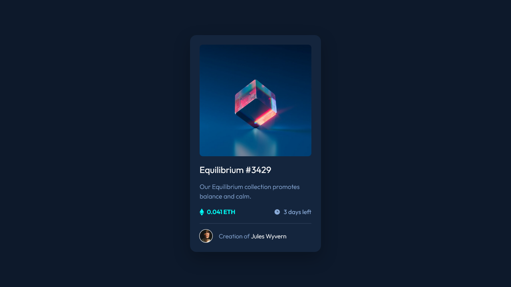

# Frontend Mentor - NFT preview card component solution

This is a solution to the [NFT preview card component challenge on Frontend Mentor](https://www.frontendmentor.io/challenges/nft-preview-card-component-SbdUL_w0U). Frontend Mentor challenges help you improve your coding skills by building realistic projects.

## Table of contents

- [Overview](#overview)
  - [The challenge](#the-challenge)
  - [Screenshot](#screenshot)
  - [Links](#links)
- [My process](#my-process)
  - [Built with](#built-with)
  - [What I learned](#what-i-learned)
- [Author](#author)

## Overview

### The challenge

Users should be able to:

- View the optimal layout depending on their device's screen size
- See hover states for interactive elements

### Screenshot



### Links

- Solution URL: [Add solution URL here](https://your-solution-url.com)
- Live Site URL: [Add live site URL here](https://your-live-site-url.com)

## My process

### Built with

- CSS custom properties
- Flexbox
- CSS Grid
- Mobile-first workflow

### What I learned

I've learned how to use the `::before ::after` pseudo property and to combine it with `:hover` I also practiced in plain CSS to use as few classes as possible with some complex CSS selector combinations.

```css
.card-image:hover::after {
  content: "";
  position: absolute;
  /* inset: 0 is equivalent to top: 0, bottom: 0, left... */
  inset: 0;
  background-image: url("./images/icon-view.svg");
  background-repeat: no-repeat;
  background-position: center;
  background-color: var(--clr-primary-300A);
  cursor: pointer;
}
```

## Author

- Frontend Mentor - [@MateusAbelli](https://www.frontendmentor.io/profile/MateusAbelli)
